# ws2pgdb

Package contains several functions that retrieve, filter, and store NOAA data in a local/remote Postgres database.
One useful function takes weather station locations in a region and constructs a Voronoi tessellation over that region (you will need a GIS software to visualize the output which is a set of geometries/polygons).
Another useful function iteratively requests several years of data from the NOAA digital warehouse. Since NOAA permits only one year of data requested at a time via the rnoaa package, it is particularly useful when many years of information are needed.

## Prerequisites

### Database + PL/R functions only
If you only need the PostgreSQL database with PostGIS and PL/R functions running inside a container, the only requirement is:

- **[Docker Desktop](https://www.docker.com/products/docker-desktop/)** — available for macOS, Windows, and Linux

Everything else (PostgreSQL, PostGIS, PL/R, R, GDAL) is bundled inside the container image.

### R package (local usage)
If you also want to run the R functions in this package outside the container:

- **R** (≥ 3.4.0) — https://www.r-project.org
- **System libraries** — `libgdal`, `libproj`, `libgeos` (see the **Problems** section below for installation instructions)
- **NOAA API token** — required for weather data retrieval (see [NOAA Configuration](#noaa-configuration-pg_configyml))

### Optional
- **[QGIS](https://qgis.org/download/)** — to visualize spatial data (county tracts, Voronoi tessellations, weather station locations) stored in the database

## Problems

Some system libraries are needed before you can start using ws2pgdb. Some of the methods necessitate the octave development tools, gdal, proj (`octave-dev`, `liboctave`, `libgdal`, `libproj-dev`). Try to install ws2pgdb and the installer will let you know when a library is needed. This may be a slow process but if you are using any Debian-like system, you can make use of the package manager:

```bash
apt-get install octave-dev liboctave-dev libgdal-dev libproj-dev
```

During a fresh installation, after a couple of months without touching these libraries, you may get dependency compatibility errors. To install these dependencies:

```r
devtools::install_github("rstats-db/RPostgres")
```

or

```bash
sudo su - -c "R -e \"install.packages('packagename', repos='http://cran.rstudio.com/')\""
```

## Census Data

Functions in this bundle request information from your local database. The database is assumed to contain U.S. Census data — cartographic boundary files a.k.a TIGER files in SHAPEFILE format. In the past QGIS was used to upload these files into the GIS-enabled Postgres database, but shapefiles can also be uploaded via command line using `psql` and `shp2pgsql`.

The data is available at:
https://www.census.gov/geo/maps-data/data/cbf/cbf_counties.html

For the original dissertation, TIGER files from 2013 were used: nation, state, county.

## PLR/SQL and PLPGSQL

The following functions enable communication between the vector-borne simulator and PostgreSQL.

Copy, paste, and execute the queries found in `sql/pg.spi.foo.sql` on the pgsql server.

## Docker Setup

The `sql/pg.spi.foo.sql` functions are automatically loaded into the container on first run. No manual steps needed — just pull the image from Docker Hub and run the container.

The image is available on Docker Hub at:
[https://hub.docker.com/r/drabravo/pg-gis-plr](https://hub.docker.com/r/drabravo/pg-gis-plr)

### Pull from Docker Hub (recommended)

```bash
docker pull drabravo/pg-gis-plr:latest
docker run --name pg-gis-plr -e POSTGRES_PASSWORD=mysecretpassword -p 5432:5432 -d drabravo/pg-gis-plr:latest
docker logs pg-gis-plr
```

### Build locally from source

```bash
docker rm -f pg-gis-plr
docker build -t drabravo/pg-gis-plr:3.5.2 docker/
docker run --name pg-gis-plr -e POSTGRES_PASSWORD=mysecretpassword -p 5432:5432 -d drabravo/pg-gis-plr:3.5.2
docker logs pg-gis-plr
```

### Connect to the database

```bash
docker exec -it pg-gis-plr psql -U postgres -d us_gis
```

### Stop and Start

```bash
docker stop pg-gis-plr
docker start pg-gis-plr
```

### Manage via script

```bash
./docker/manage.sh
```

## Loading County Tracts

Use the built-in `load_county_tracts()` function to download and load Census TIGER tract data for any US county:

```sql
SELECT load_county_tracts('48061');  -- Cameron County, TX
SELECT load_county_tracts('26125');  -- Oakland County, MI
```

Or use option **9** in `manage.sh` to be prompted for a FIPS code interactively.

## Loading Shapefiles Manually

With the port exposed (`-p 5432:5432`), `shp2pgsql` can be run locally and piped directly into the container.

Convert the shapefile to SQL, then load it into the database:

```bash
shp2pgsql -s 4269 -W UTF-8 tl_2010_48113_tract10.shp tl_2010_48113_tract10 us_gis > tl_2010_48113_tract10.sql
psql -h localhost -p 5432 -U postgres -d us_gis -f tl_2010_48113_tract10.sql
```

Or pipe directly in one step:

```bash
shp2pgsql -s 4269 -W UTF-8 tl_2010_48113_tract10.shp tl_2010_48113_tract10 us_gis | psql -h localhost -p 5432 -U postgres -d us_gis
```

The SRID (e.g. `4269`) can be found by opening the `.prj` file of your shapefile and pasting its content into https://spatialreference.org.

## Visualizing GIS Data with QGIS

[QGIS](https://qgis.org) is a free and open-source Geographic Information System that can connect directly to the `us_gis` PostgreSQL database to visualize spatial data such as county tracts, Voronoi tessellations, and weather station locations.

Download QGIS at: https://qgis.org/download/

To connect QGIS to the container:
1. Open QGIS
2. In the **Browser panel**, right-click **PostgreSQL** → **New Connection**
3. Enter the connection details below
4. Click **Test Connection** then **OK**
5. Browse and drag layers into the map canvas

## NOAA Configuration (pg_config.yml)

Several R functions in this package retrieve weather data from NOAA via the `rnoaa` package. They expect a YAML configuration file named `pg_config.yml` in the user's home directory — `~/pg_config.yml` on the local machine, or `/root/pg_config.yml` inside the container.

A template is provided at `docker/pg_config.yml`. Copy it to `~/.docker/pg_config.yml` and fill in your NOAA token:

```bash
mkdir -p ~/.docker
cp docker/pg_config.yml ~/.docker/pg_config.yml
```

Edit `~/.docker/pg_config.yml` with your values:

```yaml
dbhost: localhost
dbport: 5432
dbname: us_gis
dbuser: postgres
dbpwd: mysecretpassword
token: <your_noaa_token>
```

To obtain a NOAA API token, register at: https://www.ncdc.noaa.gov/cdo-web/token

The file lives at `~/.docker/pg_config.yml` — outside the repository — so your token is never at risk of being accidentally committed. The `docker/pg_config.yml` in the repo is a placeholder template only.

To copy your config into the running container use option **11** in `manage.sh`, or manually:

```bash
docker cp ~/.docker/pg_config.yml pg-gis-plr:/root/pg_config.yml
```

## Client Connection Details

| Parameter | Value |
|---|---|
| Host | `localhost` |
| Port | `5432` |
| Database | `us_gis` |
| User | `postgres` |
| Password | `mysecretpassword` |


## Diagram showing where all fits together under a Docker container

The diagram below illustrates how the R package, SQL functions, Docker container, and external data sources (NOAA, Census TIGER) interact. Click any node to navigate to its source file.

```mermaid
flowchart TD

subgraph group_external["External sources"]
  node_noaa(("NOAA<br/>remote API"))
  node_census["TIGER shapefiles<br/>spatial source"]
end

subgraph group_r["R package"]
  node_ws_pkg["ws2pgdb<br/>R package"]
  node_meta_load["Metadata loaders<br/>R ingest"]
  node_data_load["Data loaders<br/>R ingest"]
  node_span_ops["Span batching<br/>R iterator"]
  node_ingest_db["DB ingest<br/>R loader<br/>[df_2_pgdb.R]"]
  node_spatial_ops["Spatial analysis<br/>R geoprocess<br/>[canopiVoronoi.R]"]
  node_coords["Station coords<br/>R transform<br/>[all_coor_ws.R]"]
  node_voronoi["Voronoi tools<br/>R geoprocess<br/>[createVoronoi.R]"]
end

subgraph group_db["Spatial database"]
  node_db_image[("PostGIS image<br/>postgres runtime")]
  node_db_sql["Stored functions<br/>SQL/PLpgSQL<br/>[functions.sql]"]
  node_spi_sql["SPI bridge<br/>SQL/PLR helper<br/>[pg.spi.foo.sql]"]
end

subgraph group_infra["Container and delivery"]
  node_db_init["Init script<br/>bootstrap<br/>[init-db.sh]"]
  node_db_cfg["pg_config.yml<br/>[pg_config.yml]"]
  node_manage["manage.sh<br/>ops script<br/>[manage.sh]"]
  node_ci["Docker publish<br/>CI workflow<br/>[docker-publish.yml]"]
end

subgraph group_consumers["Consumers"]
  node_qgis["QGIS<br/>GIS client"]
end

subgraph group_docs["Docs and sample"]
  node_sample["Watts sample<br/>example data<br/>[Watts.rda]"]
  node_workflow["Workflow docs<br/>documentation<br/>[workflow.html]"]
end

node_noaa -->|"station metadata"| node_meta_load
node_noaa -->|"observations"| node_data_load
node_span_ops -->|"batch requests"| node_noaa
node_ws_pkg -->|"orchestrates"| node_meta_load
node_ws_pkg -->|"orchestrates"| node_data_load
node_ws_pkg -->|"coordinates"| node_spatial_ops
node_meta_load -->|"load table"| node_ingest_db
node_data_load -->|"load table"| node_ingest_db
node_coords -->|"feeds"| node_voronoi
node_spatial_ops -->|"derives"| node_coords
node_spatial_ops -->|"computes"| node_voronoi
node_census -->|"load boundaries"| node_db_image
node_db_init -->|"bootstraps"| node_db_image
node_db_sql -->|"installs"| node_db_image
node_spi_sql -->|"installs"| node_db_image
node_db_cfg -->|"configures"| node_ws_pkg
node_db_cfg -->|"configures"| node_db_image
node_manage -->|"manages"| node_db_image
node_ci -->|"publishes"| node_db_image
node_db_image -->|"serves GIS"| node_qgis
node_sample -->|"example input"| node_ws_pkg
node_workflow -->|"documents"| node_ws_pkg

click node_ws_pkg "https://github.com/rabravo/ws2pgdb/tree/main/DESCRIPTION"
click node_meta_load "https://github.com/rabravo/ws2pgdb/blob/main/R/ws_metadata_span_2_pgdb.R"
click node_data_load "https://github.com/rabravo/ws2pgdb/blob/main/R/ws_data_avg_span_2_pgdb.R"
click node_span_ops "https://github.com/rabravo/ws2pgdb/blob/main/R/ws_metadata_span_2_pgdb.R"
click node_ingest_db "https://github.com/rabravo/ws2pgdb/blob/main/R/df_2_pgdb.R"
click node_spatial_ops "https://github.com/rabravo/ws2pgdb/blob/main/R/canopiVoronoi.R"
click node_coords "https://github.com/rabravo/ws2pgdb/blob/main/R/all_coor_ws.R"
click node_voronoi "https://github.com/rabravo/ws2pgdb/blob/main/R/createVoronoi.R"
click node_db_image "https://github.com/rabravo/ws2pgdb/tree/main/docker/Dockerfile"
click node_db_sql "https://github.com/rabravo/ws2pgdb/blob/main/sql/functions.sql"
click node_spi_sql "https://github.com/rabravo/ws2pgdb/blob/main/sql/pg.spi.foo.sql"
click node_db_init "https://github.com/rabravo/ws2pgdb/blob/main/docker/init-db.sh"
click node_db_cfg "https://github.com/rabravo/ws2pgdb/blob/main/docker/pg_config.yml"
click node_manage "https://github.com/rabravo/ws2pgdb/blob/main/docker/manage.sh"
click node_ci "https://github.com/rabravo/ws2pgdb/blob/main/.github/workflows/docker-publish.yml"
click node_sample "https://github.com/rabravo/ws2pgdb/blob/main/data/Watts.rda"
click node_workflow "https://github.com/rabravo/ws2pgdb/blob/main/docs/workflow.html"

classDef toneNeutral fill:#f8fafc,stroke:#334155,stroke-width:1.5px,color:#0f172a
classDef toneBlue fill:#dbeafe,stroke:#2563eb,stroke-width:1.5px,color:#172554
classDef toneAmber fill:#fef3c7,stroke:#d97706,stroke-width:1.5px,color:#78350f
classDef toneMint fill:#dcfce7,stroke:#16a34a,stroke-width:1.5px,color:#14532d
classDef toneRose fill:#ffe4e6,stroke:#e11d48,stroke-width:1.5px,color:#881337
classDef toneIndigo fill:#e0e7ff,stroke:#4f46e5,stroke-width:1.5px,color:#312e81
classDef toneTeal fill:#ccfbf1,stroke:#0f766e,stroke-width:1.5px,color:#134e4a
class node_noaa,node_census toneBlue
class node_ws_pkg,node_meta_load,node_data_load,node_span_ops,node_ingest_db,node_spatial_ops,node_coords,node_voronoi toneAmber
class node_db_image,node_db_sql,node_spi_sql toneMint
class node_db_init,node_db_cfg,node_manage,node_ci toneRose
class node_qgis toneIndigo
class node_sample,node_workflow toneTeal

```



